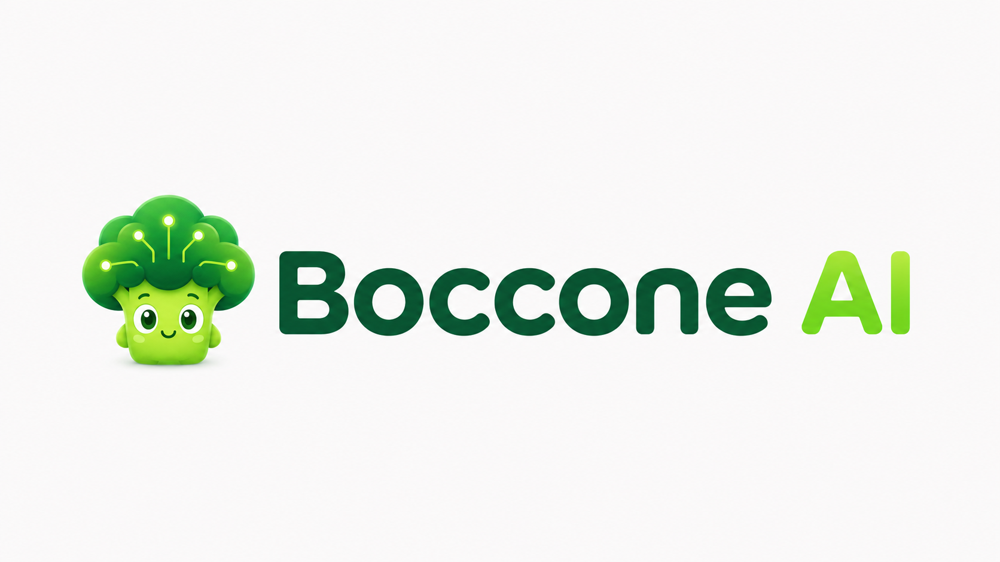
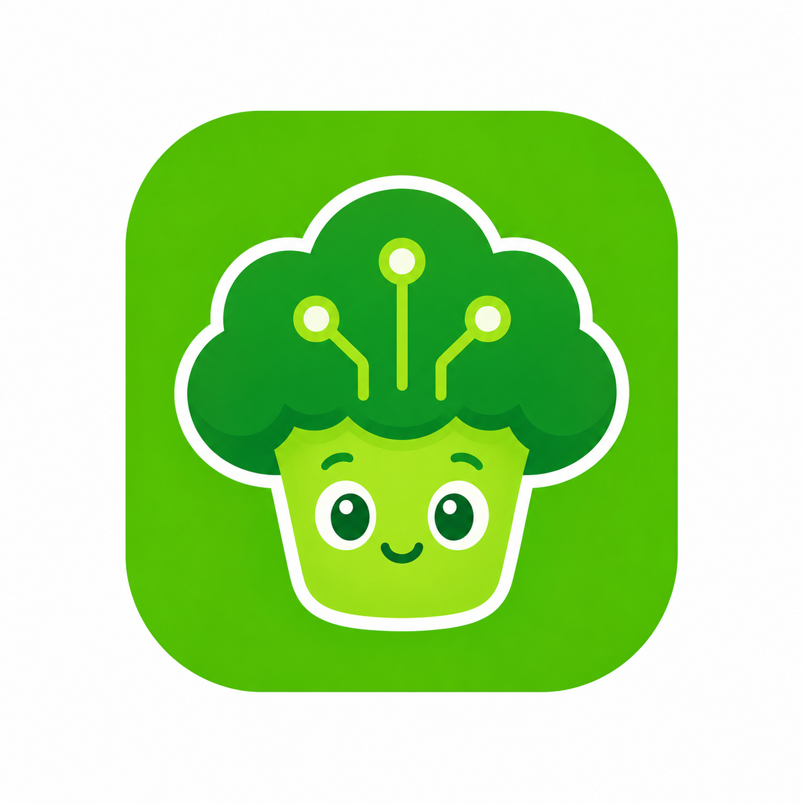

<p align="center">
  
</p>

<h1 align="center">Boccone AI</h1>

<p align="center">
  Open-source, mobile-first food diary for tracking calories and macronutrients with reviewable AI estimates.
</p>

<p align="center">
  <a href="https://github.com/dbbd59/boccone-ai/actions/workflows/ci.yml"></a>
</p>

Boccone AI is being built for people who want a calmer, more transparent way to understand what they eat. The product direction combines self-defined nutrition targets, manual and AI-assisted meal logging, a diary, simple statistics, and an assistant grounded in a user’s own history.

> [!IMPORTANT]
> Boccone AI is in early development. The current repository delivers the monorepo, API, authentication foundation, database migrations, shared contracts, an OpenAPI-generated client, UI primitives, mobile/admin auth surfaces, authenticated daily nutrition targets, manual meal logging with Today aggregation, a five-area mobile navigation shell, date-based Calendar browsing, paginated Diary history, canonical meal detail/edit/delete flows, a real-data personal Insights slice, a real-data Admin Analytics workspace, and the first provider-agnostic AI meal-draft vertical. Known meals remain a planned product slice.

## Product direction

The full product scope is documented in [PRD.md](PRD.md). Planned capabilities include:

- daily calorie, protein, carbohydrate, and fat targets defined by the user;
- meal entry by manual input, text, camera, or gallery;
- one or more images per meal, normalized AI output, uncertainty ranges, and an edit-before-save step;
- diary and calendar browsing with editable meal history;
- weekly and monthly calorie/macronutrient trends through the personal Insights view;
- reusable known meals, without treating them as model training;
- an assistant that answers questions using the user’s food history.

Product guardrails are part of the design, not polish added later:

- Boccone AI is not a medical, clinical, or diagnostic nutrition tool;
- AI output is an estimate and never authoritative; users review it before saving;
- meal photos are transient and must not become a permanent photo archive;
- admin access is operational and must never expose plaintext AI keys or silently impersonate users;
- the MVP does not target offline-first sync, social features, health-device integrations, or automatic calorie-needs calculations.

## Visual identity

The repository includes four brand assets used to establish Boccone AI’s visual language:

<p align="center">
  
  
  
</p>

<p align="center">
  <sub>Emblem · app icon · mascot illustration</sub>
</p>

## What exists today

The implemented foundation is intentionally small and explicit:

- **API** — Elysia on Bun with request IDs, structured redacted logging, CORS, shared error responses, health checks, and modular dependency injection for tests.
- **Authentication** — Better Auth with email/password, optional Google and Apple OAuth, password-reset hooks, session-cookie identity, a simple <code>user</code>/<code>admin</code> role model, and rate limiting.
- **Authorization** — protected <code>/api/me</code> and <code>/api/admin/*</code> routes resolve identity from the server-side session; client-supplied user IDs are ignored.
- **Database** — PostgreSQL via Drizzle ORM and <code>postgres-js</code>, with versioned migrations for Better Auth’s user, session, account, verification, admin-audit, daily-target, confirmed-meal, encrypted AI-provider-config, and privacy-safe AI-usage tables. Meal photos, prompts, responses, and provider payloads are not persisted.
- **Food catalog** — local normalized foods, Italian aliases, gram-weight portions, provenance, private user submissions, admin moderation, and immutable meal nutrition snapshots. Download/import workflow is documented in <a href="docs/food-catalog.md">docs/food-catalog.md</a>.
- **AI harness** — <code>packages/ai</code> centralizes TanStack AI adapters for OpenAI, Anthropic, Gemini, OpenRouter, and OpenAI-compatible endpoints, structured output, narrow catalog tools, model capabilities, safe errors, timeouts, cancellation, and mock seams. API keys are BYOK and AES-256-GCM encrypted at rest.
- **Contracts** — Zod schemas define public health, user, admin-user, daily-target, meal, AI draft/settings/usage, and error response shapes. Raw database rows do not form the public API.
- **API client** — the checked-in OpenAPI description generates fetch, Zod, and TanStack Query artifacts in <code>packages/api-client</code>; clients share one typed HTTP boundary.
- **Clients** — an Expo Router mobile app with persisted English/Italian localization, native Home/Meals/Calendar/Diary/Settings navigation, system/light/dark appearance, a Today summary, a dedicated Meals area, a real-data Insights route with range selection, nutrient detail, accessible trends, and honest no-data states, date-based Calendar browsing that hands off to Diary, paginated Diary history, a canonical meal detail route, manual add/edit/delete meal flow, “Dillo a Boccone” natural-language drafting with review before save, and nested Settings for profile, appearance, targets, language, account controls, and BYOK AI settings. The Vite/React admin surface provides sign-in, server-side admin access checks, user search, user detail/edit, role changes, ban/unban, removal, audit-log inspection, daily-target CRUD, meal CRUD, privacy-safe AI usage inspection, and a date-filtered Analytics workspace for product activity, nutrition, catalog moderation, and AI operations. The admin surface is English-only for now.
- **UI foundation** — a layered design system (<a href="docs/design-system.md">docs/design-system.md</a>): <code>design-tokens</code> (semantic light/dark themes, spacing, typography, motion, WCAG-tested contrast, and material roles) plus mirrored React Native and web primitives (<code>Text</code>, <code>Button</code>, <code>Input</code>, <code>Field</code>, <code>Screen</code>, <code>Surface</code>, <code>GlassSurface</code>, <code>Stack</code>, <code>Alert</code>, …). Native iOS 26 Liquid Glass is guarded at runtime with tokenized fallbacks for older iOS, Android, and web; a dev-only showcase remains available at <code>/dev/design-system</code> on mobile.

## Architecture

```text
┌──────────────────────┐        session cookies / HTTP        ┌─────────────────────┐
│ apps/mobile          │ ───────────────────────────────────▶ │ apps/api            │
│ Expo + React Native  │                                      │ Elysia + Bun        │
└──────────────────────┘                                      └──────────┬──────────┘
                                                                          │
┌──────────────────────┐        session cookies / HTTP                    │
│ apps/admin           │ ──────────────────────────────────────────────────┘
│ Vite + React         │                                                   │
└──────────────────────┘                                                   │
                                                                          ▼
                                                         ┌──────────────────────────┐
                                                         │ packages/auth            │
                                                         │ Better Auth              │
                                                         └────────────┬─────────────┘
                                                                      ▼
                                                         ┌──────────────────────────┐
                                                         │ packages/db              │
                                                         │ Drizzle + postgres-js    │
                                                         └────────────┬─────────────┘
                                                                      ▼
                                                         ┌──────────────────────────┐
                                                         │ PostgreSQL               │
                                                         └──────────────────────────┘
```

Shared contracts sit in <code>packages/contracts</code>; the generated client is configured in <code>packages/api-client</code>; design tokens are consumed by both UI packages. The API composes route modules and injects auth dependencies so integration tests can build a complete app against an isolated database.

### Mobile information architecture

The authenticated mobile shell has five stable destinations, each with one job:

| Area     | Responsibility                                                                                              |
| -------- | ----------------------------------------------------------------------------------------------------------- |
| Home     | What matters today: a concise nutrition/activity summary and the primary Add meal action.                   |
| Meals    | The current day’s logged food, grouped by meal category, with one canonical meal detail route.              |
| Calendar | Lightweight date-oriented activity browsing that hands off selected dates to Diary.                         |
| Diary    | Chronological, date-grouped meal history with daily totals, incremental loading, and canonical meal detail. |
| Settings | Account and app configuration, with nested profile, appearance, and target screens.                         |

Meal details live at <code>/meals/{mealId}</code>, so Home, Meals, Calendar, and Diary share one resource representation. Manual creation and editing use <code>/meals/new</code> and <code>/meals/{mealId}/edit</code>; the legacy <code>/add-meal</code> path redirects for existing deep links.

## Tech stack

| Area                        | Technology                                               |
| --------------------------- | -------------------------------------------------------- |
| Runtime and package manager | Bun <code>&gt;=1.4.0</code>                              |
| Workspace orchestration     | Bun workspaces and Turborepo                             |
| API                         | TypeScript, Elysia, <code>@elysiajs/cors</code>          |
| AI                          | TanStack AI adapters, Zod structured output, BYOK        |
| Authentication              | Better Auth, Drizzle adapter, Expo plugin, admin plugin  |
| Database                    | PostgreSQL 17, Drizzle ORM/Kit, <code>postgres-js</code> |
| Validation                  | Zod                                                      |
| API client                  | OpenAPI 3, Hey API, TanStack Query                       |
| Mobile client               | Expo, Expo Router, React Native, React Native Web        |
| Admin client                | Vite, React, React DOM                                   |
| Quality tooling             | TypeScript strict mode, ESLint, Prettier, Bun test       |
| CI                          | GitHub Actions with a PostgreSQL service                 |

## Requirements

- [Bun 1.4 or newer](https://bun.com/docs/installation)
- Docker with Docker Compose, for local PostgreSQL
- Git

Node.js and a separately installed PostgreSQL server are not required for the documented local workflow.

## Quick start

From a fresh checkout:

```bash
git clone https://github.com/dbbd59/boccone-ai.git
cd boccone-ai
bun install
cp .env.example .env
```

The example environment targets the PostgreSQL container in <code>docker-compose.yml</code> on port <code>5433</code>. Replace <code>BETTER_AUTH_SECRET</code> with a strong secret of at least 32 characters before using the API beyond local development.

Start the database and apply migrations:

```bash
bun run db:up
bun run db:migrate
```

Start the API:

```bash
bun run dev:api
```

The API listens on <code>http://localhost:3000</code> by default. Verify it from another terminal:

```bash
curl http://localhost:3000/api/health
```

Run the client shells in separate terminals when needed:

```bash
bun run dev:admin   # Vite admin surface, http://localhost:3001
bun run dev:mobile  # Expo development server
```

<code>apps/mobile</code> defaults to <code>http://localhost:3000</code> for the API. A physical device usually needs <code>EXPO_PUBLIC_API_URL</code> set to an address reachable from that device, such as the development machine’s LAN address.

## Configuration

Copy [.env.example](.env.example) to <code>.env</code>. The API loads the nearest <code>.env</code> while allowing explicitly exported environment variables to win.

### API environment

| Variable                                                                                                                                            | Required | Purpose                                                                                                         |
| --------------------------------------------------------------------------------------------------------------------------------------------------- | -------- | --------------------------------------------------------------------------------------------------------------- |
| <code>DATABASE_URL</code>                                                                                                                           | Yes      | PostgreSQL connection string. Local default uses port <code>5433</code>.                                        |
| <code>BETTER_AUTH_SECRET</code>                                                                                                                     | Yes      | Session/auth secret; minimum 32 characters.                                                                     |
| <code>BETTER_AUTH_URL</code>                                                                                                                        | Yes      | Public API base URL used for auth callbacks.                                                                    |
| <code>NODE_ENV</code>                                                                                                                               | No       | <code>development</code>, <code>test</code>, or <code>production</code>; defaults to <code>development</code>.  |
| <code>API_PORT</code>                                                                                                                               | No       | API port from <code>1</code> to <code>65535</code>; defaults to <code>3000</code>.                              |
| <code>LOG_LEVEL</code>                                                                                                                              | No       | <code>debug</code>, <code>info</code>, <code>warn</code>, or <code>error</code>; defaults to <code>info</code>. |
| <code>CORS_ALLOWED_ORIGINS</code>                                                                                                                   | No       | Comma-separated browser origins. Native <code>boccone://</code> deep links are configured in code.              |
| <code>AI_ENCRYPTION_KEY</code>                                                                                                                      | No*      | 32-byte base64 or 64-character hex AES-256-GCM key for encrypted user provider keys.                            |
| <code>GOOGLE_CLIENT_ID</code> / <code>GOOGLE_CLIENT_SECRET</code>                                                                                   | No       | Enable Google OAuth when both are set.                                                                          |
| <code>APPLE_SERVICES_ID</code>, <code>APPLE_BUNDLE_ID</code>, <code>APPLE_TEAM_ID</code>, <code>APPLE_KEY_ID</code>, <code>APPLE_PRIVATE_KEY</code> | No       | Enable Apple OAuth only when all five values are set.                                                           |

Partially configured OAuth providers are rejected at startup. For local callbacks, register the provider redirect URL using the value of <code>BETTER_AUTH_URL</code>:

```text
{BETTER_AUTH_URL}/api/auth/callback/google
{BETTER_AUTH_URL}/api/auth/callback/apple
```

<code>APPLE_PRIVATE_KEY</code> accepts a single-line value with <code>\n</code> escapes. The API restores PEM newlines before minting Apple client-secret JWTs.

<code>AI_ENCRYPTION_KEY</code> is optional until a user saves a BYOK key; set it
in every environment that enables AI settings. Generate it with
<code>openssl rand -base64 32</code>. See [docs/ai.md](docs/ai.md) for the
provider, draft, privacy, and testing boundaries.

### Client environment

The client packages also accept optional, client-specific environment variables:

| File                          | Variable                         | Default                            |
| ----------------------------- | -------------------------------- | ---------------------------------- |
| <code>apps/mobile/.env</code> | <code>EXPO_PUBLIC_API_URL</code> | <code>http://localhost:3000</code> |
| <code>apps/admin/.env</code>  | <code>VITE_API_URL</code>        | <code>http://localhost:3000</code> |

Do not put server secrets in either client environment.

## API surface

The API currently exposes these application routes:

| Method              | Path                                                 | Auth          | Description                                                                                        |
| ------------------- | ---------------------------------------------------- | ------------- | -------------------------------------------------------------------------------------------------- |
| <code>GET</code>    | <code>/api/health</code>                             | Public        | Returns service status, version, request ID, and timestamp.                                        |
| <code>ALL</code>    | <code>/api/auth/*</code>                             | Better Auth   | Email/password, password reset, and configured social-auth handlers.                               |
| <code>GET</code>    | <code>/api/me</code>                                 | Session       | Returns the authenticated user’s public contract.                                                  |
| <code>GET</code>    | <code>/api/me/ai/settings</code>                     | Session       | Returns provider/model settings without the stored key.                                            |
| <code>PUT</code>    | <code>/api/me/ai/settings</code>                     | Session       | Stores a provider/model and encrypts a BYOK key when supplied.                                     |
| <code>DELETE</code> | <code>/api/me/ai/settings/api-key</code>             | Session       | Removes the stored provider key.                                                                   |
| <code>POST</code>   | <code>/api/me/ai/test-connection</code>              | Session       | Verifies the configured provider with a bounded request.                                           |
| <code>POST</code>   | <code>/api/me/ai/interpret-meal</code>               | Session       | Returns a catalog-backed MealDraft; it never creates a meal.                                       |
| <code>GET</code>    | <code>/api/me/targets</code>                         | Session       | Returns the authenticated user’s optional daily calorie and macro targets.                         |
| <code>PUT</code>    | <code>/api/me/targets</code>                         | Session       | Replaces the authenticated user’s daily targets; each value may be cleared with <code>null</code>. |
| <code>GET</code>    | <code>/api/me/meals?date=YYYY-MM-DD</code>           | Session       | Returns manually logged meals and nutrition totals for one calendar day.                           |
| <code>GET</code>    | <code>/api/me/diary?before=YYYY-MM-DD&limit=7</code> | Session       | Returns paginated, date-grouped meal history before an exclusive local-date cursor.                |
| <code>POST</code>   | <code>/api/me/meals</code>                           | Session       | Creates a manually logged meal.                                                                    |
| <code>GET</code>    | <code>/api/me/meals/{id}</code>                      | Session       | Returns one meal owned by the authenticated user.                                                  |
| <code>PATCH</code>  | <code>/api/me/meals/{id}</code>                      | Session       | Updates one meal owned by the authenticated user.                                                  |
| <code>DELETE</code> | <code>/api/me/meals/{id}</code>                      | Session       | Removes one meal owned by the authenticated user.                                                  |
| <code>GET</code>    | <code>/api/admin/users</code>                        | Admin session | Lists users with optional email <code>search</code>, <code>limit</code>, and <code>offset</code>.  |
| <code>GET</code>    | <code>/api/admin/users/{id}</code>                   | Admin session | Returns one operational user record.                                                               |
| <code>GET</code>    | <code>/api/admin/users/{id}/targets</code>           | Admin session | Inspects one user’s daily targets.                                                                 |
| <code>PUT</code>    | <code>/api/admin/users/{id}/targets</code>           | Admin session | Replaces one user’s daily targets; null clears individual values.                                  |
| <code>DELETE</code> | <code>/api/admin/users/{id}/targets</code>           | Admin session | Removes one user’s daily-target record.                                                            |
| <code>GET</code>    | <code>/api/admin/users/{id}/meals</code>             | Admin session | Lists up to 50 manually logged meals for one user.                                                 |
| <code>POST</code>   | <code>/api/admin/users/{id}/meals</code>             | Admin session | Creates a meal for one user and records an audit action.                                           |
| <code>GET</code>    | <code>/api/admin/users/{id}/meals/{mealId}</code>    | Admin session | Returns one meal for one user.                                                                     |
| <code>PATCH</code>  | <code>/api/admin/users/{id}/meals/{mealId}</code>    | Admin session | Updates one meal and records an audit action.                                                      |
| <code>DELETE</code> | <code>/api/admin/users/{id}/meals/{mealId}</code>    | Admin session | Removes one meal and records an audit action.                                                      |
| <code>POST</code>   | <code>/api/admin/users</code>                        | Admin session | Creates a user through Better Auth’s admin API.                                                    |
| <code>PATCH</code>  | <code>/api/admin/users/{id}</code>                   | Admin session | Updates a user’s name and/or email.                                                                |
| <code>POST</code>   | <code>/api/admin/users/{id}/role</code>              | Admin session | Changes a user between the explicit <code>user</code> and <code>admin</code> roles.                |
| <code>POST</code>   | <code>/api/admin/users/{id}/ban</code>               | Admin session | Bans a user with an optional reason and duration.                                                  |
| <code>POST</code>   | <code>/api/admin/users/{id}/unban</code>             | Admin session | Removes the user ban.                                                                              |
| <code>DELETE</code> | <code>/api/admin/users/{id}</code>                   | Admin session | Removes the account and linked auth data.                                                          |
| <code>GET</code>    | <code>/api/admin/audit-logs</code>                   | Admin session | Lists paginated admin account/application-data actions with actor and target details.              |
| <code>GET</code>    | <code>/api/admin/ai/usage</code>                     | Admin session | Lists provider/model/token/latency/status metadata without prompts or responses.                   |

The machine-readable API description is [packages/api-client/openapi.yaml](packages/api-client/openapi.yaml). It drives the generated fetch, Zod, and TanStack Query client artifacts.

Errors use a shared envelope with machine-readable codes such as <code>unauthorized</code>, <code>forbidden</code>, <code>not_found</code>, <code>validation_error</code>, and <code>internal_error</code>. Clients should branch on <code>error.code</code>, not on human-readable messages.

### Example: sign up and read the current user

```bash
curl -i -c /tmp/boccone-cookies.txt \
  -H 'content-type: application/json' \
  -d '{"name":"Ada Lovelace","email":"ada@example.test","password":"correct-horse-42"}' \
  http://localhost:3000/api/auth/sign-up/email

curl -b /tmp/boccone-cookies.txt \
  http://localhost:3000/api/me
```

In development, password-reset links are logged to the API console so the flow can be exercised without an email provider. Production deliberately fails until a real sender is wired in <code>apps/api/src/email.ts</code>.

## Repository layout

```text
apps/
  api/                 Elysia HTTP API, auth wiring, routes, services, tests
  admin/               Vite/React operational user-management surface
  mobile/              Expo Router auth and initial app shell

packages/
  auth/                Better Auth factory and OAuth helpers
  config/              Shared ESLint flat configuration
  contracts/           Zod request/response contracts
  db/                  Drizzle schema, client, and migrations
  api-client/          OpenAPI document and generated fetch/Zod/Query clients
  design-tokens/       Shared colors, spacing, type, radius, and shadow tokens
  ui-mobile/           React Native primitives
  ui-web/              React/web primitives and CSS
  utils/                Small shared runtime utilities, including .env loading

PRD.md                 Product scope and guardrails
AGENTS.md               Repository and contribution operating rules
docker-compose.yml      Development-only PostgreSQL service
.env.example            Environment template
.github/workflows/ci.yml
                       CI workflow
```

<code>packages/ai</code> owns provider-specific adapters and the provider-neutral harness. Feature/domain code stays in the API service layer; clients consume generated contracts only.

## Commands

Run commands from the repository root.

| Command                           | Purpose                                                 |
| --------------------------------- | ------------------------------------------------------- |
| <code>bun install</code>          | Install workspace dependencies.                         |
| <code>bun run dev</code>          | Start all workspace development tasks.                  |
| <code>bun run dev:api</code>      | Start only the API with Bun watch mode.                 |
| <code>bun run dev:admin</code>    | Start the admin Vite server on port <code>3001</code>.  |
| <code>bun run dev:mobile</code>   | Start the Expo development server.                      |
| <code>bun run build</code>        | Run configured workspace build tasks through Turborepo. |
| <code>bun run lint</code>         | Run ESLint across workspaces.                           |
| <code>bun run typecheck</code>    | Run TypeScript checks across workspaces.                |
| <code>bun run test</code>         | Run workspace tests.                                    |
| <code>bun run format</code>       | Format repository files with Prettier.                  |
| <code>bun run format:check</code> | Check Prettier formatting without writing.              |
| <code>bun run db:up</code>        | Start local PostgreSQL in Docker.                       |
| <code>bun run db:down</code>      | Stop local Docker services.                             |
| <code>bun run db:generate</code>  | Generate a Drizzle migration from schema changes.       |
| <code>bun run db:migrate</code>   | Apply pending migrations.                               |
| <code>bun run db:studio</code>    | Start Drizzle Studio.                                   |

When the API description changes, regenerate the shared client from its package directory:

```bash
cd packages/api-client
bun run generate
cd ../..
```

## Testing and CI

API tests live in [apps/api/test](apps/api/test). They cover health and 404 contracts, email/password auth, password reset behavior, session invalidation, admin authorization, complete user-management mutations and audit logging, daily-target persistence and validation, email search, identity-boundary checks, environment validation, and secret-safe structured logging.

Integration tests create a throwaway PostgreSQL database, apply the checked-in migrations, run the suite, and remove the database during cleanup. Start the local database before running them:

```bash
bun run db:up
bun run test
```

The [CI workflow](.github/workflows/ci.yml) runs on pushes to <code>main</code> and pull requests. It provisions PostgreSQL 17, installs with the frozen Bun lockfile, applies migrations, then runs lint, typecheck, and tests.

## Deployment status

<code>docker-compose.yml</code> is for local development only. The repository currently contains no Dockerfile, Railway configuration, or automated production deployment workflow. Project guidance identifies Railway as the intended infrastructure target; production deployment still needs an explicit runtime configuration.

Before enabling production authentication:

- inject secrets through the deployment environment, never source control;
- configure trusted CORS origins and OAuth callback URLs for the deployed API;
- wire a transactional email provider in <code>apps/api/src/email.ts</code>;
- use a production PostgreSQL database and run migrations as part of release operations.

## Contributing

Start with [AGENTS.md](AGENTS.md) and [PRD.md](PRD.md). Contributions should follow the project’s vertical-slice model: keep schema, contracts, backend behavior, clients, tests, and documentation aligned when a feature needs them.

Before opening a pull request:

1. keep shared packages independent from app packages;
2. keep public API contracts in <code>packages/contracts</code> and database access in <code>packages/db</code>;
3. avoid logging secrets or persisting meal photos;
4. run the relevant checks from the command table;
5. describe any environment, migration, or security implications.

There is no separate <code>CONTRIBUTING.md</code> or <code>CODE_OF_CONDUCT.md</code> in the repository yet. Bug reports and focused feature proposals can be opened in the [issue tracker](https://github.com/dbbd59/boccone-ai/issues). Never include credentials, private keys, session tokens, or sensitive user data in a public issue.

## License

The root <code>package.json</code> declares the project as **MIT**. A root <code>LICENSE</code> file is not currently committed, so the license text should be added before distributing a release. For reference, see the [MIT License text published by the Open Source Initiative](https://opensource.org/license/mit).
